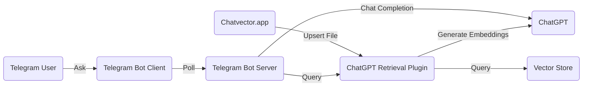

```mermaid

flowchart LR
    J(Telegram User) --> |Ask| A(Telegram Bot Client)
    A -->|Poll| B(Telegram Bot Server)
    B -->|Query| C(ChatGPT Retrieval Plugin)
    C -->|Generate Embeddings| D(ChatGPT)
    B -->|Chat Completion| D(ChatGPT)
    C -->|Query| E(Vector Store)
    F(Chatvector.app) -->|Upsert File| C
```

