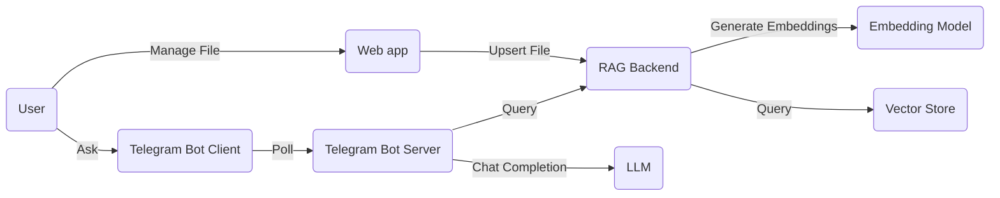

```mermaid

flowchart LR
    J(User) --> |Ask| A(Telegram Bot Client)
    A -->|Poll| B(Telegram Bot Server)
    B -->|Query| C(RAG Backend)
    C -->|Generate Embeddings| D(Embedding Model)
    B -->|Chat Completion| E(LLM)
    C -->|Query| F(Vector Store)
    G(Web app) -->|Upsert File| C
    J --> |Manage File| G
```

