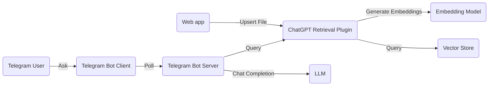

```mermaid

flowchart LR
    J(Telegram User) --> |Ask| A(Telegram Bot Client)
    A -->|Poll| B(Telegram Bot Server)
    B -->|Query| C(ChatGPT Retrieval Plugin)
    C -->|Generate Embeddings| D(Embedding Model)
    B -->|Chat Completion| E(LLM)
    C -->|Query| F(Vector Store)
    G(Web app) -->|Upsert File| C
```

